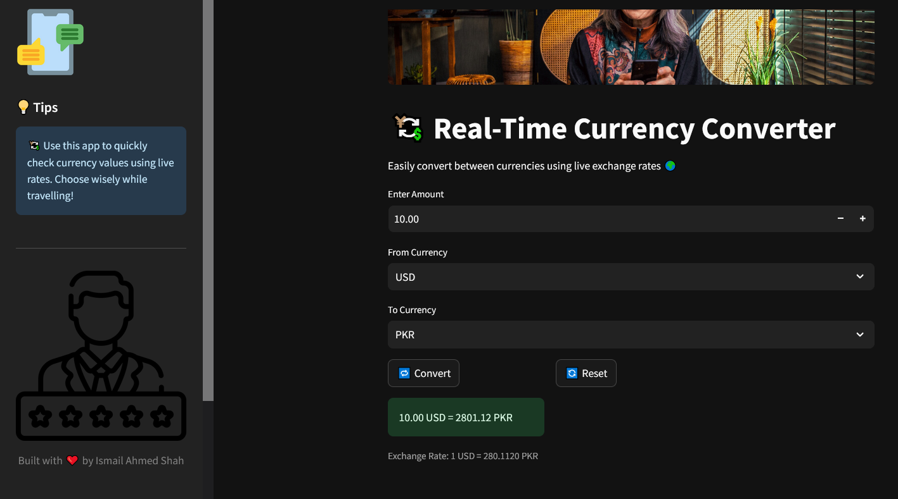

# 💱 Currency Converter App (with Real-Time Exchange Rates)

A user-friendly **Currency Converter Web App** built using **Python** and **Streamlit**. It uses real-time exchange rates powered by **ExchangeRate-API** to convert any amount from one currency to another 🌍.

---

## 🚀 Features

- 🔁 Convert between 30+ currencies using **live exchange rates**
- 🔎 Input amount, select “from” and “to” currencies
- 💬 Instant feedback with exchange rate breakdown
- 🌗 Clean dark-themed UI with colorful accents
- 🧹 Includes reset button to clear inputs and recalculate

---

## 📸 Screenshots

 
---

## 🔧 Technologies Used

- **Python**
- **Streamlit**
- **ExchangeRate-API**
- **Requests** (for API call)

---

## 🌐 Live App

🔗 [Click to open live demo](https://your-streamlit-link.streamlit.app)

---

## ⚙️ How It Works

1. Enter the amount to convert  
2. Choose your source & target currencies  
3. Click `Convert` to get real-time results  
4. Optional: Click `Reset` to clear session

---

## 💡 Pro Tips

- 💰 Track your favorite conversions
- 🌓 You can customize the theme via `.streamlit/config.toml`

---

## 🙌 Credits

Made with ❤️ by [Ismail Ahmed Shah](https://www.linkedin.com/in/ismail-ahmed-shah-2455b01ba/)

---

## 🗣 Suggestions?

Feel free to drop feedback or ideas. Collaboration always welcome!
